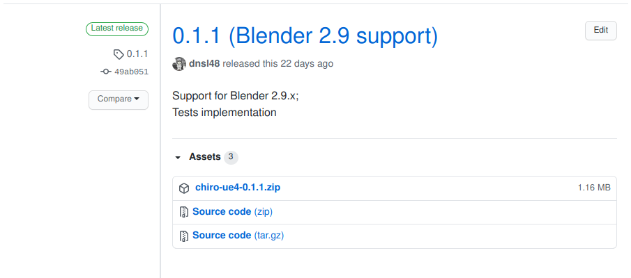

# Installation

## Download

You may download releases from:

 - [GitHub Release page](https://github.com/vespero-group/chiro-ue4/releases)

In the screenshot below the table "Assets" contains 3 items.  
The top asset called `chiro-ue4-0.1.1.zip` is the release archive.  
The other two archives below are for developers only.

!!! Note
    Ignore this note if you download the release archive from the page linked above.

    If you prefer installing the add-on by cloning the repository via `git clone`,
    rather than downloading the release archive, be sure to pull the binary assets with
    `git-lfs`.  
    Some functionality will not work without those (e.g. adding meshes).  

## Install

You may install the addon in any way
[supported](https://docs.blender.org/manual/en/latest/editors/preferences/addons.html) by Blender.

## Get notified about new releases

GitHub has a built-in notification system. To get notified about new releases you may
start watching new releases for the project. On the [project page](https://github.com/vespero-group/chiro-ue4/)
in the top right corner you can find the button `Watch`. There you may do as on the video below:

!!! Example
    <video controls width="388" border="1">
      <source src="../img/installation/notification.webm" type="video/webm">
    </video>

## Configuration

There are 2 configuration options. They enable extra features not needed for most of the usual workflows.

 - Advanced features (disabled). This option makes some advanced tools to appear in UI. Most of those are used internally by other tools and are not required for straightforward use.

 - Developer mode (disabled). This option makes a developer UI panel to show up. The panel comprises tools only needed for developers of this addon and not required for any usual workflows.
